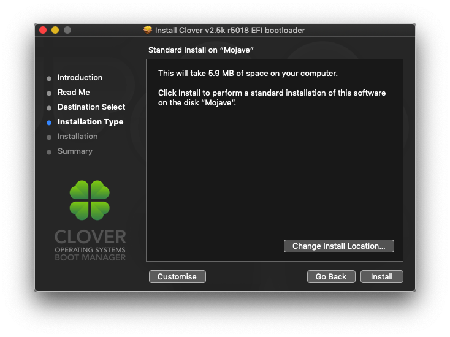
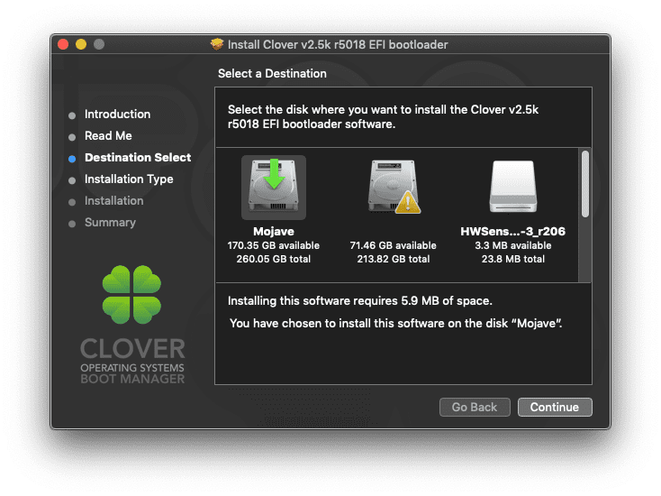
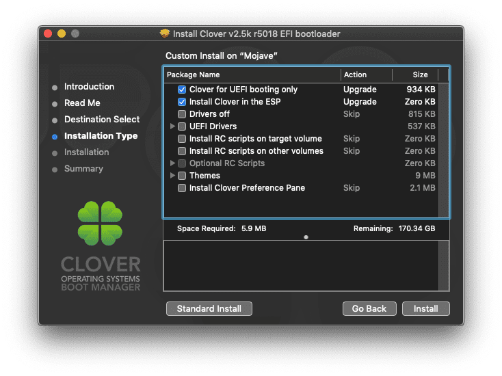

# Beginner installation guide (Deprecated)

## Pre Installation

### Requirements
 - An active internet connection and Apple Mac
 - USB Stick minimum 8GB
 - Mac OS High Sierra or Mac OS Mojave should be already downloaded
 
### Tools required
 - [UniBeast](https://www.tonymacx86.com/resources/categories/tonymacx86-downloads.3)(Download as per OS version)
 

 ### Guide
 Follow this guide to create bootable USB.

 https://www.tonymacx86.com/threads/unibeast-install-macos-mojave-on-any-supported-intel-based-pc.259381/

 Use UniBeast to create bootable USB drive. It will take some time, after finished make a sure EFI Folder is mounted. 

 Now you have to download latest/applicable CLOVER.zip file from my repo. Now open EFI Folder of your USB drive and replace downloaded folder.

 Now your USB drive is ready to boot!

 ## Post Installation Guide

 ### Guide
 
 First you need to download [Clover EFI bootloader](https://sourceforge.net/projects/cloverefiboot/).

 Right click and open installer. Follow this screenshots to install it.

 First you have to click `Change Install Location`
 

 Select disk where your macOS is installed.
 

 Then you have to click `Customise` options
 

 Now you have to download latest/applicable CLOVER.zip file from my repo. Now open EFI Folder of your **HDD/SDD Drive** (Not USB drive) and replace downloaded folder.

 Now you can directly boot from HDD/SSD.
