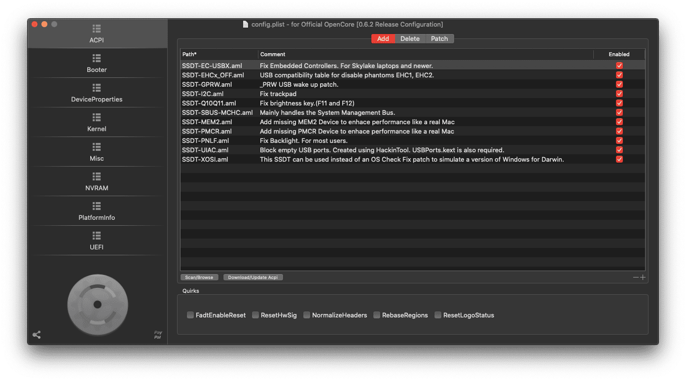
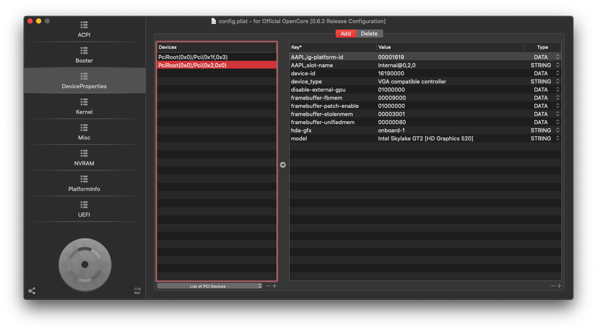
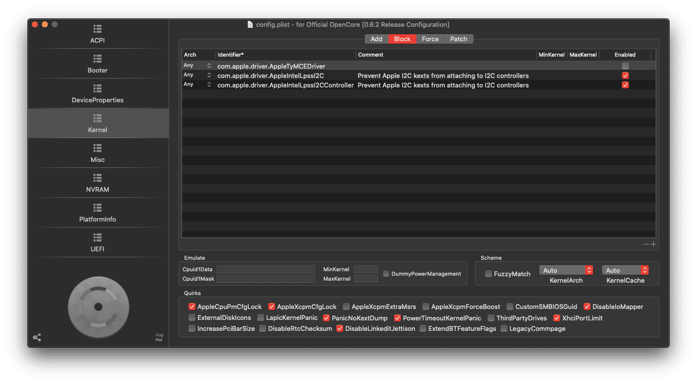
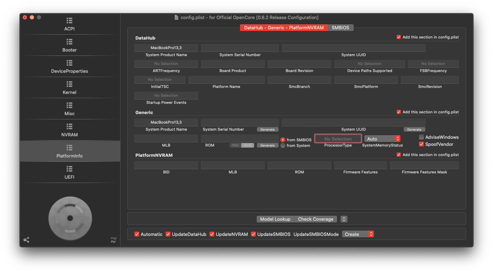

# OpenCore 0.6.3 Installation guide

## TODO
 - Add refrence for patches
 - Add what modified compared to Sample.plist
 

## Requirements
 - An active internet connection and Apple Mac
 - USB Stick minimum 8GB
 
## Tools required
 - `OpenCore Configurator` or `Plist editor`

 ## Guide
 Follow Dortania's guide to create bootable USB. You can use macOS, Linux or Windows.

 https://dortania.github.io/OpenCore-Install-Guide/installer-guide/

 After USB has been created, download latest OpenCore release build from Dortania's github repo.

 https://github.com/acidanthera/OpenCorePkg

 I have modified the Dortania's Skylake guide. Follow it:


 ## ACPI

### Add and Quirks
 

### Delete
Ignore

### Patch
 
 ## Booter

 ### MmioWhitelist and Quirks

Note:
**RebuildAppleMemoryMap: can break on some laptop OEM firmwares so if you receive early boot failures disable this**

 
 

## DeviceProperties

### Add

For Audio:
 

For Graphics:
 

### Delete

Ignore


## Kernel

### Add
Note: **Please uncheck duplicate kext. I did already:)**
 

### Block
Note:
`com.apple.driver.AppleIntelLpssI2C` and `com.apple.driver.AppleIntelLpssI2CController` must be blocked in order to correctly work touchpad.

 

### Patch
Ignore or You can enable/add according to your need ex: `Enable Trim For SSD`


## Misc

### Boot
Note: **External picker must be selected in order to show picker UI.**
 

### Debug

 

### Security
Note: **Make a sure that `SecureBootModel` is `Disabled`. Otherwise You will get KP in MacOS Big Sure 11.0 beta 10.**
 


## NVRAM

### Add -> ```4D1EDE05-38C7-4A6A-9CC6-4BCCA8B38C14```
Ignore

### Add -> ```4D1FDA02-38C7-4A6A-9CC6-4BCCA8B30102```
Ignore

### Add -> ```7C436110-AB2A-4BBB-A880-FE41995C9F82```

Note: The ```boot-args``` is ```dart=0 darkwake=1 shikigva=40 -igfxnohdmi -disablegfxfirmware -wegnoegpu```

 

### Delete 
Ignore

### LegacySchema 
Ignore


## Platform Info
Note: System ProfuctName Should be ```MacBookPro13,3``` Also please generate your own serial no.
 


## UEFI

### APFS, Audio, Inout,Output, ProtocolOverrides and ReservedMemory 

Ignore

### Drivers
Note: `PointerSupportMode` should be empty.
 

### Input
Note: `PointerSupportMode` should be empty.
 

### Quirks
Make a sure ```ReleaseUsbOwnership``` is checked otherwise  kp on boot occurs.
