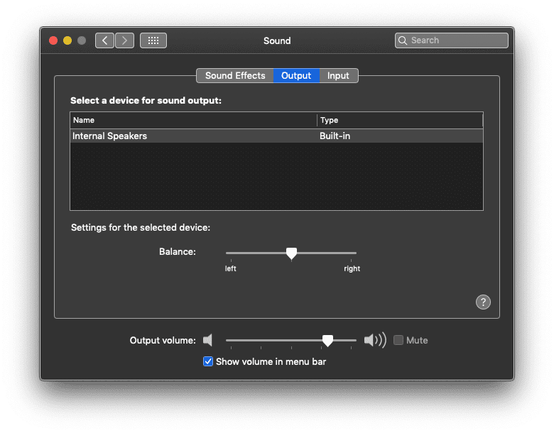
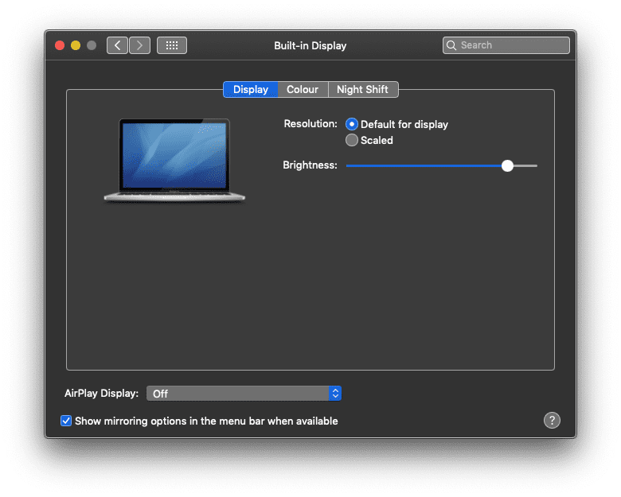
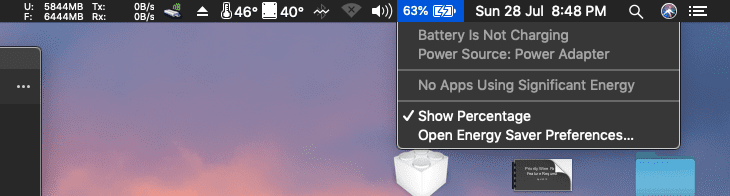
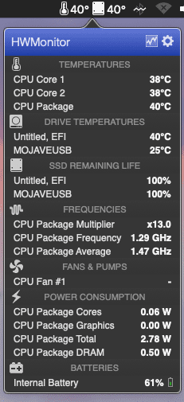
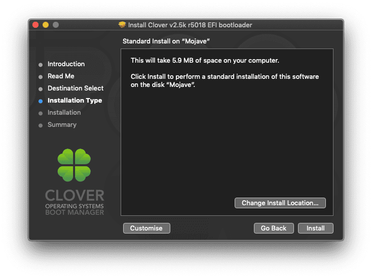
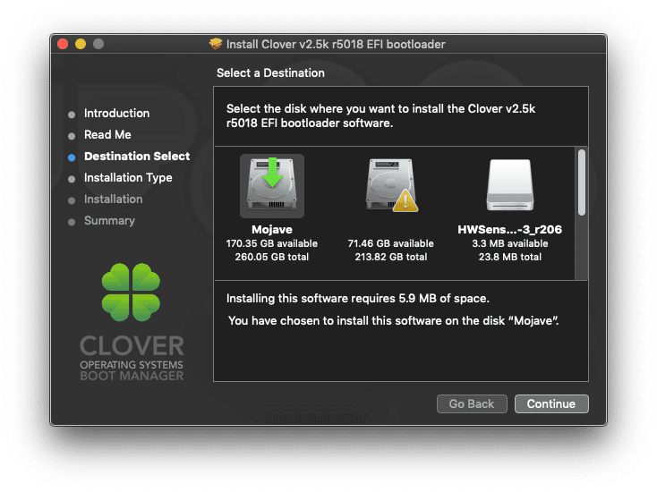

# Instillation (Deprecated)

# Requirements
 - An active internet connection and Apple Mac
 - USB Stick minimum 8GB
 - Mac OS High Sierra or Mac OS Mojave should be already downloaded
 
### Tools required
 - Xcode or any Plist editor
 - [Clover Configurator](https://mackie100projects.altervista.org/download-clover-configurator/)
 - [UniBeast - Mojave](https://www.tonymacx86.com/resources/unibeast-9-2-0-mojave.426/)
 
 First, use UniBeast-Mojave to create bootable USB drive. It will take some time after finished make a sure EFI Folder is mounted. Now download [config_HD515_520_530_540.plist](https://github.com/RehabMan/OS-X-Clover-Laptop-Config/blob/master/config_HD515_520_530_540.plist) from https://github.com/RehabMan/OS-X-Clover-Laptop-Config and save it and open it with Clover Configurator. 
 
 # Issues
 
 ### Fix Audio
   
  First you need to download  [AppleALC](https://github.com/acidanthera/AppleALC) kext. then you need to place AppleALC.kext on EFI/CLOVER/kexts/Other folder.
 
  Then Go to Clover Configurator->Devices->Audio->Inject add audio id `20` and check `ResetHDA`

  Then Go to Clover Configurator->Devices->Devices*
  
  Select/Add `PciRoot(0)/Pci(0x1f,3)` now delete all properties keys and add `layout-id` value `20` as `Number`.
  See below screenshots:
  
 
  ### Fix Graphics
  
  For reference see this post:
  [Intel Framebuffer patching using WhateverGreen](https://www.tonymacx86.com/threads/guide-intel-framebuffer-patching-using-whatevergreen.256490/)
  
  Currently, NVIDIA graphics not working so you need to use Intel HD 520 for this.
  
  You need to download [Lilu kext](https://github.com/acidanthera/Lilu) place Lilu.kext on EFI/CLOVER/kexts/Other folder. You also need to download [WhateverGreen kext](https://github.com/acidanthera/whatevergreen) to work intel hd graphics place WhateverGreen.kext in EFI/CLOVER/kexts/Other folder
  
  First Go to Clover Configurator->Boot->Arguments add `nv_disable=1`

  You need to edit plist as below:
  Go to Clover Configurator->Devices->Devices*

  Select/Add `PciRoot(0)/Pci(0x02,0)` now add `device-id` value `16190000' as 'Data`
  See below screenshots:
  

  Now go to Clover Configurator->Graphics and make a sure Inject ATI, Inject Intel and  Inject NVidia is unchecked. See below screenshots:
  
 
  ### Fix Backlight
   
  You need to download  [AppleBacklightFixup](https://bitbucket.org/RehabMan/applebacklightfixup/downloads/) kext. then you need to place AppleBacklightFixup.kext on EFI/CLOVER/kexts/Other folder.

  ### Fix Battery Status
  
  You need to download  [ACPIBatteryManager](https://github.com/RehabMan/OS-X-ACPI-Battery-Driver) kext. then you need to place ACPIBatteryManager.kext on EFI/CLOVER/kexts/Other folder.

  ### Fix Ethernet
  
  You need to download  [RealtekRTL8111](https://github.com/RehabMan/OS-X-Realtek-Network) kext. then you need to place RealtekRTL8111.kext on EFI/CLOVER/kexts/Other folder.

  ### Android USB tethering
  You have to download [HoRNDIS](https://github.com/jwise/HoRNDIS) to enable USB tethering.

  ### Hardware Monitor
  
  
  For hardware monitor such as CPU usages, temperature of CPU cores you can download [RehabMan-FakeSMC](https://bitbucket.org/RehabMan/os-x-fakesmc-kozlek/downloads/) kext and then you need to place all kext on EFI/CLOVER/kexts/Other folder.

  ### Fix Touchpad
   Please see detailed guide from [here](Touchpad-Guide.md)

 ## Post Installation Guide

 ### Guide
 First you need to download [Clover EFI bootloader](https://sourceforge.net/projects/cloverefiboot/).

 Right click and open installer. Follow this screenshots to install it.

 First you have to click `Change Install Location`
 

 Select disk where your macOS is installed.
 

 Then you have to click `Customise` options
 

 Now you have to download latest/applicable CLOVER.zip file from my repo. Now open EFI Folder of your **HDD/SDD Drive** (Not USB drive) and replace downloaded folder.

 Now you can directly boot from HDD/SSD.
