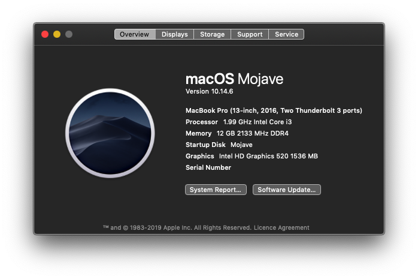
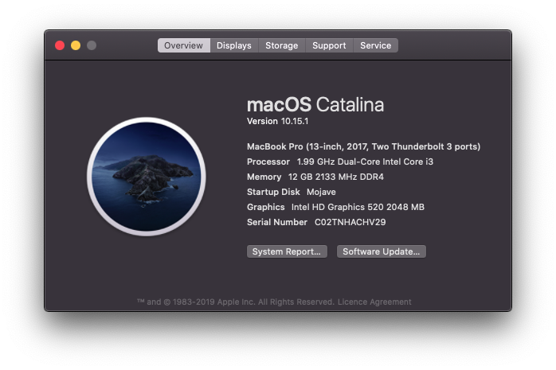

# Lenovo-Ideapad-320-15ISK-14ISK-Laptop-Hackintosh
Goal of this repo is to run Mac os on Lenovo Ideapad 320 15ISK Laptop

macOS Mojave 10.15.5            |  macOS Catalina 10.15.0
:-------------------------:|:-------------------------:
  |  

## macOS Mojave to Catalina direct upgrade note:
 1. Download latest [Clover](10.15.x/10.15.1/CLOVER.zip) and overwrite with existing one
 2. Update all kexts to latest version
 3. Use `lilucpu=8` for Skylake and `lilucpu=9` for KabyLake processor from clover boot lag

## Detailed Installed Guide

Go to [INSTALLATION_GUIDE_BEGINNERS.md](INSTALLATION_GUIDE_BEGINNERS.md)(**For beginners**)

Go to [INSTALLATION_GUIDE.md](INSTALLATION_GUIDE.md)(**For advanced user only**) for detailed guide.

Go to [WIRELESS_CARD_BUYING_GUIDE.md](WIRELESS_CARD_BUYING_GUIDE.md)(**Supported WiFi adapters and buying guide**) for detailed guide.

## About this Laptop

## Hardware Status

Type | Spec | Status | Link
---------|:---------:|----------:|----------
Computer		| Lenovo Ideapad 320-15ISK 80XH01DNIN   | Working | -
BIOS Version	| LENOVO Insyde EFI(4WCN29WW) | Working | -
CPU				| DualCore Intel Core i3, 2000 MHz (20 x 100) | Working | -
Chipset			| Intel Sunrise Point-LP, Intel Skylake-U | Working | -
Graphics		| Intel HD Graphics 520, NVIDIA GeForce 920MX (Using Intel GPU only) | Working | [Guide](https://www.tonymacx86.com/threads/guide-intel-framebuffer-patching-using-whatevergreen.256490/)
Audio			| Realtek ALC3240, Codec ID:10EC0230h / 17AA3809h | Working | [Guide](https://github.com/acidanthera/AppleALC/wiki/Installation-and-usage)
Ethernet		| Realtek RTL8168/8111 PCI-E Gigabit Ethernet Adapter() | Working | -
WiFi			| Intel(R) Dual Band Wireless-AC 3165 | Not Working | -
Bluetooth		| Intel(R) Wireless Bluetooth(R) | Working | -
Touchpad		| I2C ELAN0608 | Working | [Guide](Touchpad-Guide.md)
Keyboard		| - | Working | -
Webcam		| Ven id: 0x04f2(Chicony Electronics Co.,Ltd.) Product id: 0xb5d8| Working | -
Battery		|   Serial Number: L16M2PB2- 1229 Manufacturer: SMP Device Name:	L16M2PB2 | Working | -
## Software Status

Type | Spec | Status
---------|:---------:|----------
Battery Status		| - | Working
Brightness		| - | Working
Sleep/Hibernate		| - | Unknown

## Modifications

Type | Spec | Status
---------|:---------:|----------
D-Link DWA-131 Wireless N Nano USB Adapter (Black) 		| - | Working
BCM94360CS2 Wireless WIFI Bluetooth 4.0 Airport Card For Macbook Air 11" A1465 13" A1466 2013 MD711LL/A MD760 BCM94360CS2AX 		| - | Working
Wireless Bluetooth Mouse Rechargeable Mouse		| - | Working
Universal for 9.5mm CD/DVD Drive Slot (for SSD and HDD)		| - | Working

## Kext Used

Kext | Link | Status
---------|:---------:|----------
ACPIBatteryManager.kext | - | Working
AppleALC.kext | - | Working
FakeSMC_ACPISensors.kext | - | Working
FakeSMC_CPUSensors.kext | - | Working
FakeSMC_GPUSensors.kext | - | Working
FakeSMC_LPCSensors.kext | - | Working
FakeSMC_SMMSensors.kext  | - | Working
FakeSMC.kext | - | Working
Lilu.kext | - | Working
RealtekRTL8111.kext | - | Working
USBInjectAll.kext | - | Working
VoodooI2C.kext | - | Working
VoodooI2CELAN.kext | - | Working
VoodooPS2Controller.kext | - | Working
WhateverGreen.kext | - | Working
