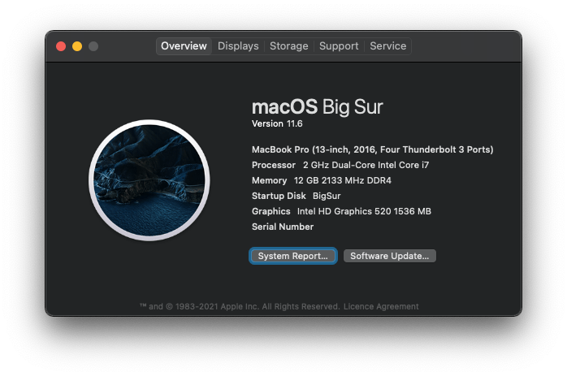
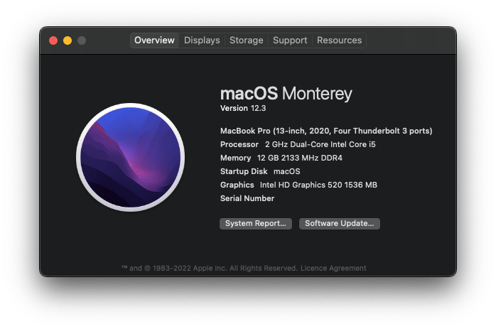
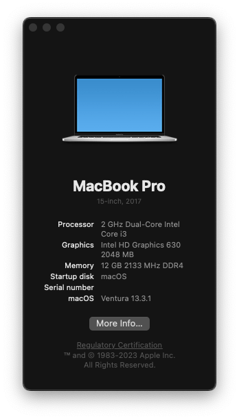

<!-- ALL-CONTRIBUTORS-BADGE:START - Do not remove or modify this section -->

<!-- ALL-CONTRIBUTORS-BADGE:END -->

# Lenovo-Ideapad-320-15ISK-14ISK-Laptop-Hackintosh

<!---

-->

Goal of this repo is to run Mac os on Lenovo Ideapad 320 15ISK Laptop

|            macOS Mojave 10.14.6             |           macOS Catalina 10.15.6            |           macOS Big Sur 11.6            |          macOS Monterey 12.3          |          macOS Ventura 13.3.1           |
| :-----------------------------------------: | :-----------------------------------------: | :-------------------------------------: | :-----------------------------------: | :-------------------------------------: |
|  |  |  |  |  |

## macOS Catalina to Big Sur direct upgrade note:

Download latest OpenCore zip folder from release and overwrite with existing one.

## macOS Monterey to Ventura direct upgrade note:

Please inject Kabylake graphics.

## OpenCore Installation Guide

Go to [INSTALLATION_GUIDE_OPENCORE.md](INSTALLATION_GUIDE_OPENCORE.md)(**Detailed guide**)

## Clover Installation Guide (Deprecated)

Go to [INSTALLATION_GUIDE_BEGINNERS.md](INSTALLATION_GUIDE_BEGINNERS.md)(**For beginners**)

Go to [INSTALLATION_GUIDE.md](INSTALLATION_GUIDE.md)(**Detailed guide - Advanced user only**)

## Other Guide

Go to [WIRELESS_CARD_BUYING_GUIDE.md](WIRELESS_CARD_BUYING_GUIDE.md)(**Supported WiFi adapters and buying guide**)

## About this Laptop

### Original Hardware Info 💻

| Type         | Spec                                                                  | Status  | Link                                                                                                     |
| :----------- | :-------------------------------------------------------------------- | :------ | :------------------------------------------------------------------------------------------------------- |
| Computer     | Lenovo Ideapad 320-15ISK 80XH01DNIN                                   | Working | -                                                                                                        |
| BIOS Version | LENOVO Insyde EFI(4WCN29WW)                                           | Working | -                                                                                                        |
| CPU          | DualCore Intel Core i3, 2000 MHz (20 x 100)                           | Working | -                                                                                                        |
| Chipset      | Intel Sunrise Point-LP, Intel Skylake-U                               | Working | -                                                                                                        |
| Graphics     | Intel HD Graphics 520, NVIDIA GeForce 920MX (Using Intel GPU only)    | Working | [Guide](https://www.tonymacx86.com/threads/guide-intel-framebuffer-patching-using-whatevergreen.256490/) |
| Audio        | Realtek ALC3240, Codec ID:10EC0230h / 17AA3809h                       | Working | [Guide](https://github.com/acidanthera/AppleALC/wiki/Installation-and-usage)                             |
| Ethernet     | Realtek RTL8168/8111 PCI-E Gigabit Ethernet Adapter()                 | Working | -                                                                                                        |
| WiFi         | Intel(R) Dual Band Wireless-AC 3165                                   | Working | -                                                                                                        |
| Bluetooth    | Intel(R) Wireless Bluetooth(R)                                        | Working | -                                                                                                        |
| Touchpad     | I2C ELAN0608                                                          | Working | [Guide](Touchpad-Guide.md)                                                                               |
| Keyboard     | -                                                                     | Working | -                                                                                                        |
| Webcam       | Ven id: 0x04f2(Chicony Electronics Co.,Ltd.) Product id: 0xb5d8       | Working | -                                                                                                        |
| Battery      | Serial Number: L16M2PB2- 1229 Manufacturer: SMP Device Name: L16M2PB2 | Working | -                                                                                                        |

### Modifications 🔨

| Type                                                                                                                        | Spec                                  | Status  |
| :-------------------------------------------------------------------------------------------------------------------------- | :------------------------------------ | :------ |
| D-Link DWA-131 Wireless N Nano USB Adapter (Black)                                                                          | -                                     | Working |
| BCM94360CS2 Wireless WIFI Bluetooth 4.0 Airport Card For Macbook Air 11" A1465 13" A1466 2013 MD711LL/A MD760 BCM94360CS2AX | -                                     | Working |
| Wireless Bluetooth Mouse Rechargeable Mouse                                                                                 | -                                     | Working |
| Universal for 9.5mm CD/DVD Drive Slot (for SSD and HDD)                                                                     | -                                     | Working |
| 15.6 inch IPS LCD matrix LP156WF4 LP156WF6                                                                                  | -                                     | Working |
| G.Skill Ripjaws SO-DIMM 16GB (1 \* 16GB) DDR4 3200 CL22-22-22-52 1.20V Laptop Memory                                        | Max 20GB (4GB Soldred + 16GB G.Skill) | Working |

### Software Status 👨‍💻

| Type                            | Spec | Status  |
| :------------------------------ | :--- | :------ |
| Battery Status                  | -    | Working |
| Brightness With keys(F11 - F12) | -    | Working |
| Sleep                           | -    | Working |

### Kext Used

| Kext                                                                                                          | Info                                                                                                                                                                                                                                                                                                       |
| :------------------------------------------------------------------------------------------------------------ | :--------------------------------------------------------------------------------------------------------------------------------------------------------------------------------------------------------------------------------------------------------------------------------------------------------- |
| [AirportItlwm.kext](https://github.com/OpenIntelWireless/itlwm)                                               | Intel Wi-Fi Drivers for macOS.                                                                                                                                                                                                                                                                             |
| [AppleALC.kext](https://github.com/acidanthera/AppleALC)                                                      | For Audio.                                                                                                                                                                                                                                                                                                 |
| [BlueToolFixup.kext](https://github.com/acidanthera/BrcmPatchRAM)                                             | Required for macOS 12 or newer, as in macOS 12 Apple has changed parts of the Bluetooth stack from kernel-space to user-space                                                                                                                                                                              |
| [BrightnessKeys.kext](https://github.com/acidanthera/BrightnessKeys)                                          | Handler for brightness keys without DSDT patches                                                                                                                                                                                                                                                           |
| [CpuTscSync.kext](https://github.com/acidanthera/CpuTscSync)                                                  | It is a Lilu plugin, combining functionality of VoodooTSCSync and disabling xcpm_urgency if TSC is not in sync. It should solve kernel panics after wake.                                                                                                                                                  |
| [FeatureUnlock.kext](https://github.com/acidanthera/FeatureUnlock)                                            | Add Sidecar support to unsupported models                                                                                                                                                                                                                                                                  |
| [HibernationFixup.kext](https://github.com/acidanthera/HibernationFixup)                                      | A Lilu plugin intended to fix hibernation compatibility issues.                                                                                                                                                                                                                                            |
| [HoRNDIS.kext](https://github.com/jwise/HoRNDIS)                                                              | Android USB tethering driver for Mac OS X                                                                                                                                                                                                                                                                  |
| [HWPEnabler.kext](https://github.com/goodwin/HWPEnable)                                                       | HWP is a technology introduced in Skylake which lets the CPU select its own stepping speed without the usage of the CPU Multiplier. Additionally it trottles/boosts itself much faster, which improoves overall CPU performance. With enabled HWP you dont need to create SSDTs with CPU P-States anymore. |
| [IntelBluetoothFirmware.kext](https://github.com/OpenIntelWireless/IntelBluetoothFirmware)                    | Intel Bluetooth Drivers for macOS.                                                                                                                                                                                                                                                                         |
| [IntelBTPatcher.kext](https://github.com/zxystd/IntelBTPatcher)                                               | A Lilu base patcher that fix Intel Bluetooth on Bigsur, Catalina, Mojave, High sierra etc, tested with Bigsur and Catalina all working good.                                                                                                                                                               |
| [Lilu.kext](https://github.com/acidanthera/Lilu)                                                              | Arbitrary kext and process patching on macOS.                                                                                                                                                                                                                                                              |
| [RealtekRTL8111.kext](https://github.com/Mieze/RTL8111_driver_for_OS_X)                                       | RTL8111/8168/8411 PCI Express Gigabit Ethernet.                                                                                                                                                                                                                                                            |
| [RestrictEvents.kext](https://github.com/Mieze/RTL8111_driver_for_OS_X)                                       | Lilu Kernel extension for blocking unwanted processes causing compatibility issues on different hardware and unlocking the support for certain features restricted to other hardware.                                                                                                                      |
| [RTCMemoryFixup.kext](https://github.com/acidanthera/RTCMemoryFixup)                                          | open source kernel extension providing a way to emulate some offsets in your CMOS (RTC) memory                                                                                                                                                                                                             |
| [SMCBatteryManager.kext](https://github.com/acidanthera/VirtualSMC)                                           | Battery Status Monitoring.                                                                                                                                                                                                                                                                                 |
| [SMCProcessor.kext](https://github.com/acidanthera/VirtualSMC)                                                | Processor Temp Monitoring.                                                                                                                                                                                                                                                                                 |
| [SMCSuperIO.kext](https://github.com/acidanthera/VirtualSMC)                                                  | Fan Reading.                                                                                                                                                                                                                                                                                               |
| [USBPorts.kext](https://www.tonymacx86.com/threads/the-new-beginners-guide-to-usb-port-configuration.286553/) | For USB Port mapping.                                                                                                                                                                                                                                                                                      |
| [VirtualSMC.kext](https://github.com/acidanthera/VirtualSMC)                                                  | SMC Emulator Layer.                                                                                                                                                                                                                                                                                        |
| [VoodooInput.kext](https://github.com/acidanthera/VoodooInput)                                                | Generic Multitouch Handler kernel extension for macOS.                                                                                                                                                                                                                                                     |
| [VoodooI2CELAN.kext](https://github.com/VoodooI2C/VoodooI2C)                                                  | For ELAN Touchpad.                                                                                                                                                                                                                                                                                         |
| [VoodooI2C.kext](https://github.com/VoodooI2C/VoodooI2C)                                                      | For I2C Touchpad.                                                                                                                                                                                                                                                                                          |
| [VoodooPS2Controller.kext](https://github.com/RehabMan/OS-X-Voodoo-PS2-Controller)                            | Contains updated Voodoo PS/2 Controller, improved Keyboard & Synaptics TouchPad.                                                                                                                                                                                                                           |
| [YogaSMC.kext](https://github.com/zhen-zen/YogaSMC)                                                           | ACPI driver for OEM hardware.                                                                                                                                                                                                                                                                              |
| [WhateverGreen.kext](https://github.com/acidanthera/WhateverGreen)                                            | Various patches necessary for certain ATI/AMD/Intel/Nvidia GPUs. This is needed for Intel HD 520.                                                                                                                                                                                                          |

### SSDT Used

| Kext               | Info                                                                                                         | Refrence Link                                                                                                             |
| :----------------- | :----------------------------------------------------------------------------------------------------------- | :------------------------------------------------------------------------------------------------------------------------ |
| SSDT-EC-USBX.aml   | Fix Embedded Controllers. For Skylake laptops and newer.                                                     | [Link](https://dortania.github.io/Getting-Started-With-ACPI/Universal/ec-fix.html#fixing-embedded-controller-ssdt-ecusbx) |
| SSDT-EHCx_OFF.aml  | USB compatibility table for disable phantoms EHC1, EHC2. Only for 7,8,9-series chipsets and 10.11 and newer! | [Link](https://github.com/acidanthera/OpenCorePkg/blob/master/Docs/AcpiSamples/SSDT-EHCx_OFF.dsl)                         |
| SSDT-GPRW.aml      | \_PRW USB wake up patch.                                                                                     | [Link](https://1revenger1.gitbook.io/laptop-guide/battery-power-management/correcting-sleep-problems)                     |
| SSDT-I2C.aml       | Fix trackpad                                                                                                 | [Link](https://voodooi2c.github.io/#GPIO%20Pinning/GPIO%20Pinning)                                                        |
| SSDT-ECRW.aml      | EC reading                                                                                                   | [Link](https://github.com/zhen-zen/YogaSMC)                                                                               |
| SSDT-SBUS-MCHC.aml | Mainly handles the System Management Bus.                                                                    | [Link](https://dortania.github.io/Getting-Started-With-ACPI/Universal/smbus.html)                                         |
| SSDT-MEM2.aml      | Add missing MEM2 Device to enhance performance like a real Mac                                               | -                                                                                                                         |
| SSDT-PMCR.aml      | Add missing PMCR Device to enhance performance like a real Mac                                               | -                                                                                                                         |
| SSDT-PNLF.aml      | Fix Backlight. For most users.                                                                               | [Link](https://dortania.github.io/Getting-Started-With-ACPI/Laptops/backlight.html)                                       |
| SSDT-UIAC.aml      | Block empty USB ports. Created using HackinTool. USBPorts.kext is also required.                             | [Link](https://www.tonymacx86.com/threads/the-new-beginners-guide-to-usb-port-configuration.286553/)                      |
| SSDT-XOSI.aml      | This SSDT can be used instead of an OS Check Fix patch to simulate a version of Windows for Darwin.          | [Link](https://dortania.github.io/Getting-Started-With-ACPI/ssdt-methods/ssdt-prebuilt.html#trackpad)                     |
| SSDT-PrtSc-F13.aml | PrtSc Screenshot                                                                                             | -                                                                                                                         |

### TODO

- USB mapping tutorial.
- Separate guide for audio, graphics etc.
- Suggest to me via issue.

### Telegram Channel

- [India Hackintosh Community Group](https://t.me/indianhackintosh)
- [India Hackintosh Channel](https://t.me/hackintoshcommunity)

### Credits

- [Apple](https://www.apple.com) for macOS.
- [Acidanthera](https://github.com/acidanthera) for most of the kexts.
- [goodwin](https://github.com/goodwin) for ALCPlugFix.
- [RehabMan](https://github.com/RehabMan) for some patches.
- [Steve Zheng](https://github.com/stevezhengshiqi) for some patches.
- [Sniki](https://github.com/Sniki) for some patches.
- [daliansky](https://github.com/daliansky) for some patches.
- [Moh_Ameen](https://github.com/ameenjuz) for some patches.
- [OpenIntelWireless](https://github.com/OpenIntelWireless) for Intel WiFi drivers.
- And anyone else that helped to develop and improve hackintoshing.

## Contributors ✨

Thanks goes to these wonderful people ([emoji key](https://allcontributors.org/docs/en/emoji-key)):

<!-- ALL-CONTRIBUTORS-LIST:START - Do not remove or modify this section -->
<!-- prettier-ignore-start -->
<!-- markdownlint-disable -->
<table>
  <tr>
    <td align="center"><a href="https://netrix.cc"> <b>btx3</b></a> <a href="https://github.com/gajjartejas/Lenovo-Ideapad-320-15ISK-14ISK-Laptop-Hackintosh/commits?author=btx3" title="Tests">⚠️</a></td>
  </tr>
</table>

<!-- markdownlint-restore -->
<!-- prettier-ignore-end -->

<!-- ALL-CONTRIBUTORS-LIST:END -->

This project follows the [all-contributors](https://github.com/all-contributors/all-contributors) specification. Contributions of any kind welcome!
