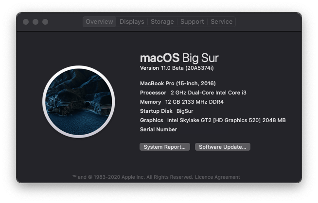

 
 
 
 

# Lenovo-Ideapad-320-15ISK-14ISK-Laptop-Hackintosh
Goal of this repo is to run Mac os on Lenovo Ideapad 320 15ISK Laptop

macOS Mojave 10.14.6            |  macOS Catalina 10.15.6 |  macOS Big Sur 11.0 developer beta 8	
:-------------------------:|:-------------------------:|:-------------------------:
  |    |  

## macOS Mojave to Catalina direct upgrade note:
 Download latest [Clover](10.15.x/10.15.4/CLOVER.zip) and overwrite with existing one and update all kexts to latest version

## OpenCore Installation Guide

Go to [INSTALLATION_GUIDE_OPENCORE.md](INSTALLATION_GUIDE_OPENCORE.md)(**Detailed guide**)

## Clover Installation Guide

Go to [INSTALLATION_GUIDE_BEGINNERS.md](INSTALLATION_GUIDE_BEGINNERS.md)(**For beginners**)

Go to [INSTALLATION_GUIDE.md](INSTALLATION_GUIDE.md)(**Detailed guide - Advanced user only**)

## Other Guide

Go to [WIRELESS_CARD_BUYING_GUIDE.md](WIRELESS_CARD_BUYING_GUIDE.md)(**Supported WiFi adapters and buying guide**)

## About this Laptop

## Original Hardware Info 💻

Type | Spec | Status | Link
---------|:---------|----------:|----------
Computer		| Lenovo Ideapad 320-15ISK 80XH01DNIN   | Working | -
BIOS Version	| LENOVO Insyde EFI(4WCN29WW) | Working | -
CPU				| DualCore Intel Core i3, 2000 MHz (20 x 100) | Working | -
Chipset			| Intel Sunrise Point-LP, Intel Skylake-U | Working | -
Graphics		| Intel HD Graphics 520, NVIDIA GeForce 920MX (Using Intel GPU only) | Working | [Guide](https://www.tonymacx86.com/threads/guide-intel-framebuffer-patching-using-whatevergreen.256490/)
Audio			| Realtek ALC3240, Codec ID:10EC0230h / 17AA3809h | Working | [Guide](https://github.com/acidanthera/AppleALC/wiki/Installation-and-usage)
Ethernet		| Realtek RTL8168/8111 PCI-E Gigabit Ethernet Adapter() | Working | -
WiFi			| Intel(R) Dual Band Wireless-AC 3165 | Not Working | -
Bluetooth		| Intel(R) Wireless Bluetooth(R) | Working | -
Touchpad		| I2C ELAN0608 | Working | [Guide](Touchpad-Guide.md)
Keyboard		| - | Working | -
Webcam		    | Ven id: 0x04f2(Chicony Electronics Co.,Ltd.) Product id: 0xb5d8| Working | -
Battery		    | Serial Number: L16M2PB2- 1229 Manufacturer: SMP Device Name:	L16M2PB2 | Working | -

## Modifications 🔨

Type | Spec | Status
--------- |:---------: |----------
D-Link DWA-131 Wireless N Nano USB Adapter (Black) | - | Working
BCM94360CS2 Wireless WIFI Bluetooth 4.0 Airport Card For Macbook Air 11" A1465 13" A1466 2013 MD711LL/A MD760 BCM94360CS2AX | - | Working
Wireless Bluetooth Mouse Rechargeable Mouse | - | Working
Universal for 9.5mm CD/DVD Drive Slot (for SSD and HDD) | - | Working
15.6 inch IPS LCD matrix LP156WF4 LP156WF6 | - | Working

## Software Status 👨‍💻

Type | Spec | Status
---------|:---------:|----------
Battery Status | - | Working
Brightness With keys(F11 - F12) | - | Working
Sleep/Hibernate | - | Fully working

## Kext Used

Kext | Info 
---------|:---------
[Lilu.kext](https://github.com/acidanthera/Lilu) | Arbitrary kext and process patching on macOS.
[AppleALC.kext](https://github.com/acidanthera/AppleALC) | For Audio.
[RealtekRTL8111.kext](https://github.com/Mieze/RTL8111_driver_for_OS_X) | RTL8111/8168/8411 PCI Express Gigabit Ethernet.
[VirtualSMC.kext](https://github.com/acidanthera/VirtualSMC) | SMC Emulator Layer.
[SMCBatteryManager.kext](https://github.com/acidanthera/VirtualSMC) | Battery Status Monitoring.
[SMCProcessor.kext](https://github.com/acidanthera/VirtualSMC) | Processor Temp Monitoring.
[SMCSuperIO.kext](https://github.com/acidanthera/VirtualSMC) | Fan Reading.
[USBPorts.kext](https://www.tonymacx86.com/threads/the-new-beginners-guide-to-usb-port-configuration.286553/) | For USB Port mapping.
[VoodooI2C.kext](https://github.com/VoodooI2C/VoodooI2C) | For I2C Touchpad.
[VoodooI2CELAN.kext](https://github.com/VoodooI2C/VoodooI2C) | For ELAN Touchpad.
[VoodooPS2Controller.kext](https://github.com/RehabMan/OS-X-Voodoo-PS2-Controller) | Contains updated Voodoo PS/2 Controller, improved Keyboard & Synaptics TouchPad.
[WhateverGreen.kext](https://github.com/acidanthera/WhateverGreen) | Various patches necessary for certain ATI/AMD/Intel/Nvidia GPUs. This is needed for Intel HD 520.
[VoodooTSCSync.kext](https://github.com/RehabMan/VoodooTSCSync) | A kernel extension which will synchronize the TSC on any Intel CPUs. Without this system hangs/freeze after awake from sleep.
[HWPEnabler.kext](https://github.com/goodwin/HWPEnable) | HWP is a technology introduced in Skylake which lets the CPU select its own stepping speed without the usage of the CPU Multiplier. Additionally it trottles/boosts itself much faster, which improoves overall CPU performance. With enabled HWP you dont need to create SSDTs with CPU P-States anymore.

## Credits
 - [Apple](https://www.apple.com) for macOS.
 - [Acidanthera](https://github.com/acidanthera) for most of the kexts.
 - [goodwin](https://github.com/goodwin) for ALCPlugFix.
 - [RehabMan](https://github.com/RehabMan) for some patches.
 - [Steve Zheng](https://github.com/stevezhengshiqi) for some patches.
 - [Sniki](https://github.com/Sniki) for some patches.
 - [daliansky](https://github.com/daliansky) for some patches.
 - [Moh_Ameen](https://github.com/ameenjuz) for some patches.
 - [al3xtjames](https://github.com/al3xtjames) for clover-theme-oss theme.
 - [ImmersiveX](https://github.com/ImmersiveX) for clover-theme-minimal-dark theme.
 - And anyone else that helped to develop and improve hackintoshing.
 - [weak self] me

