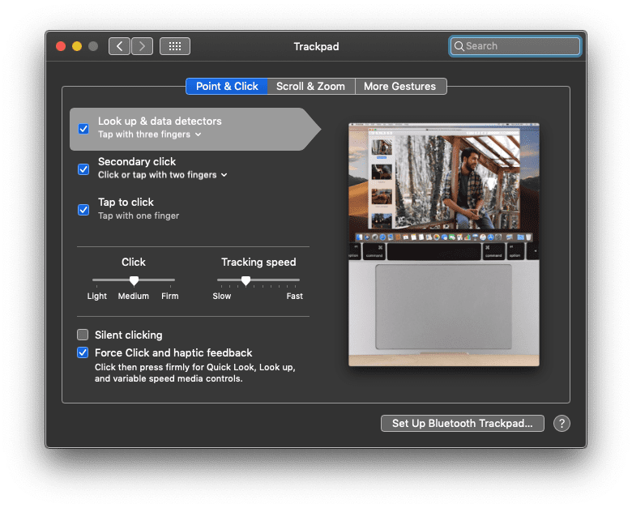

#  Installation



### Properties
```
HARDWARE IDS
ACPI\VEN_ELAN&DEV_0608
ACPI\ELAN0608
*ELAN0608

COMPATIABLE IDS
ACPI\PNP0C50
PNP0C50

BIOS DEVICE NAME
\_SB.PCI0.I2C0.TPD0

CHILDREN
HID\ELAN0608&Col01\5&17134a85&0&0000
HID\ELAN0608&Col02\5&17134a85&0&0001

```
### Add the following kexts
- [VoodooPS2Controller](https://github.com/RehabMan/OS-X-Voodoo-PS2-Controller) - If you don't have this, no keyboard and no trackpad. We'll change it later to VoodooI2C, but for now you'll need to use this (works kinda jerky on trackpad) or connect external Keyboard/mouse
- [VoodooI2C](https://github.com/alexandred/VoodooI2C) - Only VoodooI2C.kext and VoodooI2CELAN.kext(Satellite kext) is required


### Tools Used
- [Clover Configurator](http://mackie100projects.altervista.org/download-clover-configurator/)
- [iasl](https://bitbucket.org/RehabMan/acpica/downloads)
- [MaciASL](https://bitbucket.org/RehabMan/os-x-maciasl-patchmatic/downloads)

VoodooPS2Controller.kext
https://github.com/RehabMan/OS-X-Voodoo-PS2-Controller
If you don't have this, no keyboard and no trackpad. We'll change it later to VoodooI2C, but for now you'll need to use this (works kinda jerky on trackpad) or connect external Keyboard/mouse

### ACPI Patch Step
- Reboot the laptop. At Clover boot screen press F4. This will dump files in EFI/Clover/ACPI/origin.
- Boot into macOS
- Mount your EFI drive in Clover Configurator
- Copy DSDT.aml and all SSDT*.aml from EFI/Clover/ACPI/origin to a new folder named DSDT on your desktop.
- Copy MaciASL from your USB flash drive to Applications

The guide talks about duplicate SSDTs and comparing their size. I have two SSDTs with the same size but not the same content so there will be no problems later on.

In Terminal:
Code:
```sh 
git clone https://github.com/RehabMan/Intel-iasl.git iasl.git
```

It should ask you to install git. Install git. Yes, you must do it again in case if you don't had command line tools
```sh
git clone https://github.com/RehabMan/Intel-iasl.git iasl.git
cd iasl.git
make
sudo make install
sudo cp /usr/bin/iasl /Applications/MaciASL.app/Contents/MacOS/iasl61
cd *drag and drop your DSDT folder*
```

This will put you back to DSDT folder
Code:
```sh
Code: iasl -da -dl *.aml
```

Open MaciASL
In preferences, sources tab

Add RehabMan's Laptop Patches
Site : http://raw.github.com/RehabMan/Laptop-DSDT-Patch/master

Add VoodooI2C patch repo (needed for touchpad)
https://github.com/alexandred/VoodooI2C-Patches

Open all of your dsl files from your DSDT folder.
You should have pretty much the same files as me if you have the same laptop.

For DSDT.dsl, wait for the file to load completely

First apply Windows 10 Patch

Second you have to find below Scope and replace with `After Patch`

<table>
<tr>
<th>Before Patch</th>
<th>After Patch</th>
</tr>
<tr>
        <td style="width: 259px; vertical-align:top">


 ```aml
 Scope (_SB.PCI0.I2C0)
    {
        Device (TPD0)
        {
            Name (_ADR, One)  // _ADR: Address
            Name (_HID, "SYNA2B33")  // _HID: Hardware ID
            Name (_CID, "PNP0C50")  // _CID: Compatible ID
            Name (_UID, 0x0A)  // _UID: Unique ID
            Name (SBFS, ResourceTemplate ()
            {
                I2cSerialBusV2 (0x002C, ControllerInitiated, 0x00061A80,
                    AddressingMode7Bit, "\\_SB.PCI0.I2C0",
                    0x00, ResourceConsumer, _Y1D, Exclusive,
                    )
            })
            Name (SBFB, ResourceTemplate ()
            {
                I2cSerialBusV2 (0x0015, ControllerInitiated, 0x00061A80,
                    AddressingMode7Bit, "\\_SB.PCI0.I2C0",
                    0x00, ResourceConsumer, , Exclusive,
                    )
            })
            Name (SBFF, ResourceTemplate ()
            {
                I2cSerialBusV2 (0x0038, ControllerInitiated, 0x00061A80,
                    AddressingMode7Bit, "\\_SB.PCI0.I2C0",
                    0x00, ResourceConsumer, , Exclusive,
                    )
            })
            Name (SBFG, ResourceTemplate ()
            {
                GpioInt (Level, ActiveLow, Exclusive, PullDefault, 0x0000,
                    "\\_SB.PCI0.GPI0", 0x00, ResourceConsumer, ,
                    )
                    {   // Pin list
                        0x003F
                    }
            })
            Name (SBFI, ResourceTemplate ()
            {
                Interrupt (ResourceConsumer, Level, ActiveLow, Exclusive, ,, _Y1E)
                {
                    0x0000006F,
                }
            })
            CreateWordField (SBFS, \_SB.PCI0.I2C0.TPD0._Y1D._ADR, BADR)  // _ADR: Address
            CreateDWordField (SBFS, \_SB.PCI0.I2C0.TPD0._Y1D._SPE, SPED)  // _SPE: Speed
            CreateDWordField (SBFI, \_SB.PCI0.I2C0.TPD0._Y1E._INT, INT2)  // _INT: Interrupts
            CreateWordField (SBFG, 0x17, INT1)
            Method (_INI, 0, NotSerialized)  // _INI: Initialize
            {
                If (LEqual (TPTY, 0x02))
                {
                    Store ("SYNA2B33", _HID)
                    Store (0x2C, BADR)
                }

                If (LEqual (TPTY, One))
                {
                    Store ("ELAN0608", _HID)
                    Store (0x15, BADR)
                }

                If (LEqual (TPTY, 0x03))
                {
                    Store ("FTCS1000", _HID)
                    Store (0x38, BADR)
                }

                If (LLess (OSYS, 0x07DC))
                {
                    SRXO (0x0202000F, One)
                }

                Store (GNUM (0x0202000F), INT1)
                Store (INUM (0x0202000F), INT2)
                If (LEqual (SDM0, Zero))
                {
                    SHPO (0x0202000F, One)
                }
            }

            Method (_CRS, 0, Serialized)  // _CRS: Current Resource Settings
            {
                If (LGreaterEqual (OSYS, 0x07DC))
                {
                    If (LEqual (TPTY, One))
                    {
                        Store ("ELAN0608", _HID)
                        Name (SBFB, ResourceTemplate ()
                        {
                            I2cSerialBusV2 (0x0015, ControllerInitiated, 0x00061A80,
                                AddressingMode7Bit, "\\_SB.PCI0.I2C0",
                                0x00, ResourceConsumer, , Exclusive,
                                )
                        })
                    }

                    If (LEqual (TPTY, 0x02))
                    {
                        Store ("SYNA2B33", _HID)
                        Name (SBFS, ResourceTemplate ()
                        {
                            I2cSerialBusV2 (0x002C, ControllerInitiated, 0x00061A80,
                                AddressingMode7Bit, "\\_SB.PCI0.I2C0",
                                0x00, ResourceConsumer, , Exclusive,
                                )
                        })
                    }

                    If (LEqual (TPTY, 0x03))
                    {
                        Store ("FTCS1000", _HID)
                        Name (SBFF, ResourceTemplate ()
                        {
                            I2cSerialBusV2 (0x0038, ControllerInitiated, 0x00061A80,
                                AddressingMode7Bit, "\\_SB.PCI0.I2C0",
                                0x00, ResourceConsumer, , Exclusive,
                                )
                        })
                    }

                    Name (SBFI, ResourceTemplate ()
                    {
                        Interrupt (ResourceConsumer, Level, ActiveLow, Exclusive, ,, _Y1F)
                        {
                            0x00000000,
                        }
                    })
                    CreateDWordField (SBFI, \_SB.PCI0.I2C0.TPD0._CRS._Y1F._INT, INT2)  // _INT: Interrupts
                    Store (INUM (0x0202000F), INT2)
                    If (LEqual (TPTY, One))
                    {
                        Return (ConcatenateResTemplate (SBFB, SBFI))
                    }

                    If (LEqual (TPTY, 0x02))
                    {
                        Return (ConcatenateResTemplate (SBFS, SBFI))
                    }

                    If (LEqual (TPTY, 0x03))
                    {
                        Return (ConcatenateResTemplate (SBFF, SBFI))
                    }
                }

                Return (SBFI)
            }

            Method (_STA, 0, NotSerialized)  // _STA: Status
            {
                Return (0x0F)
            }

            Method (_DSM, 4, NotSerialized)  // _DSM: Device-Specific Method
            {
                If (LEqual (Arg0, ToUUID ("3cdff6f7-4267-4555-ad05-b30a3d8938de") /* HID I2C Device */))
                {
                    If (LEqual (Arg2, Zero))
                    {
                        If (LEqual (Arg1, One))
                        {
                            Return (Buffer (One)
                            {
                                 0x03                                           
                            })
                        }
                        Else
                        {
                            Return (Buffer (One)
                            {
                                 0x00                                           
                            })
                        }
                    }

                    If (LEqual (Arg2, One))
                    {
                        If (LEqual (TPTY, 0x02))
                        {
                            Return (0x20)
                        }

                        If (LEqual (TPTY, One))
                        {
                            Return (One)
                        }

                        If (LEqual (TPTY, 0x03))
                        {
                            Return (One)
                        }
                    }
                }
                ElseIf (LEqual (Arg0, ToUUID ("ef87eb82-f951-46da-84ec-14871ac6f84b")))
                {
                    If (LEqual (Arg2, Zero))
                    {
                        If (LEqual (Arg1, One))
                        {
                            Return (Buffer (One)
                            {
                                 0x03                                           
                            })
                        }
                    }

                    If (LEqual (Arg2, One))
                    {
                        If (LEqual (TPTY, One))
                        {
                            Store ("ELAN0608", _HID)
                            Return (ConcatenateResTemplate (SBFB, SBFG))
                        }

                        If (LEqual (TPTY, 0x02))
                        {
                            Store ("SYNA2B33", _HID)
                            Return (ConcatenateResTemplate (SBFS, SBFG))
                        }

                        If (LEqual (TPTY, 0x03))
                        {
                            Store ("FTCS1000", _HID)
                            Return (ConcatenateResTemplate (SBFF, SBFG))
                        }
                    }

                    Return (Buffer (One)
                    {
                         0x00                                           
                    })
                }
                Else
                {
                    Return (Buffer (One)
                    {
                         0x00                                           
                    })
                }
            }

            Method (TPRD, 0, Serialized)
            {
                Return (^^^LPCB.EC0.ECTP)
            }

            Method (TPWR, 1, Serialized)
            {
                Store (Arg0, ^^^LPCB.EC0.ECTP)
            }
        }
    }
```

</td>
        <td style="width: 259px; vertical-align:top">


```aml
Scope (_SB.PCI0.I2C0)
    {
        Device (TPD0)
        {
            Name (_ADR, One)  // _ADR: Address
            Name (_HID, "SYNA2B33")  // _HID: Hardware ID
            Name (_CID, "PNP0C50")  // _CID: Compatible ID
            Name (_UID, 0x0A)  // _UID: Unique ID
            Name (SBFS, ResourceTemplate ()
            {
                I2cSerialBusV2 (0x002C, ControllerInitiated, 0x00061A80,
                    AddressingMode7Bit, "\\_SB.PCI0.I2C0",
                    0x00, ResourceConsumer, _Y1D, Exclusive,
                    )
            })
            Name (SBFB, ResourceTemplate ()
            {
                I2cSerialBusV2 (0x0015, ControllerInitiated, 0x00061A80,
                    AddressingMode7Bit, "\\_SB.PCI0.I2C0",
                    0x00, ResourceConsumer, , Exclusive,
                    )
            })
            Name (SBFF, ResourceTemplate ()
            {
                I2cSerialBusV2 (0x0038, ControllerInitiated, 0x00061A80,
                    AddressingMode7Bit, "\\_SB.PCI0.I2C0",
                    0x00, ResourceConsumer, , Exclusive,
                    )
            })
            Name (SBFG, ResourceTemplate ()
            {
                GpioInt (Level, ActiveLow, Exclusive, PullDefault, 0x0000,
                    "\\_SB.PCI0.GPI0", 0x00, ResourceConsumer, ,
                    )
                    {   // Pin list
                        0x003F
                    }
            })
            Name (SBFI, ResourceTemplate ()
            {
                Interrupt (ResourceConsumer, Level, ActiveLow, Exclusive, ,, _Y1E)
                {
                    0x0000006F,
                }
            })
            CreateWordField (SBFS, \_SB.PCI0.I2C0.TPD0._Y1D._ADR, BADR)  // _ADR: Address
            CreateDWordField (SBFS, \_SB.PCI0.I2C0.TPD0._Y1D._SPE, SPED)  // _SPE: Speed
            CreateDWordField (SBFI, \_SB.PCI0.I2C0.TPD0._Y1E._INT, INT2)  // _INT: Interrupts
            CreateWordField (SBFG, 0x17, INT1)
            Method (_INI, 0, NotSerialized)  // _INI: Initialize
            {
                If (LEqual (TPTY, 0x02))
                {
                    Store ("SYNA2B33", _HID)
                    Store (0x2C, BADR)
                }

                If (LEqual (TPTY, One))
                {
                    Store ("ELAN0608", _HID)
                    Store (0x15, BADR)
                }

                If (LEqual (TPTY, 0x03))
                {
                    Store ("FTCS1000", _HID)
                    Store (0x38, BADR)
                }

                If (LLess (OSYS, 0x07DC))
                {
                    SRXO (0x0202000F, One)
                }

                Store (GNUM (0x0202000F), INT1)
                Store (INUM (0x0202000F), INT2)
                If (LEqual (SDM0, Zero))
                {
                    SHPO (0x0202000F, One)
                }
            }

            Method (_CRS, 0, Serialized)  // _CRS: Current Resource Settings
            {
                If (LGreaterEqual (OSYS, 0x07DC))
                {
                    If (LEqual (TPTY, One))
                    {
                        Store ("ELAN0608", _HID)
                        Name (SBFB, ResourceTemplate ()
                        {
                            I2cSerialBusV2 (0x0015, ControllerInitiated, 0x00061A80,
                                AddressingMode7Bit, "\\_SB.PCI0.I2C0",
                                0x00, ResourceConsumer, , Exclusive,
                                )
                        })
                    }

                    Return (ConcatenateResTemplate (SBFB, SBFG))
                    If (LEqual (TPTY, 0x02))
                    {
                        Store ("SYNA2B33", _HID)
                        Name (SBFS, ResourceTemplate ()
                        {
                            I2cSerialBusV2 (0x002C, ControllerInitiated, 0x00061A80,
                                AddressingMode7Bit, "\\_SB.PCI0.I2C0",
                                0x00, ResourceConsumer, , Exclusive,
                                )
                        })
                    }

                    If (LEqual (TPTY, 0x03))
                    {
                        Store ("FTCS1000", _HID)
                        Name (SBFF, ResourceTemplate ()
                        {
                            I2cSerialBusV2 (0x0038, ControllerInitiated, 0x00061A80,
                                AddressingMode7Bit, "\\_SB.PCI0.I2C0",
                                0x00, ResourceConsumer, , Exclusive,
                                )
                        })
                    }

                    Name (SBFI, ResourceTemplate ()
                    {
                        Interrupt (ResourceConsumer, Level, ActiveLow, Exclusive, ,, _Y1F)
                        {
                            0x00000000,
                        }
                    })
                    CreateDWordField (SBFI, \_SB.PCI0.I2C0.TPD0._CRS._Y1F._INT, INT2)  // _INT: Interrupts
                    Store (INUM (0x0202000F), INT2)
                    If (LEqual (TPTY, One))
                    {
                        Return (ConcatenateResTemplate (SBFB, SBFI))
                    }

                    If (LEqual (TPTY, 0x02))
                    {
                        Return (ConcatenateResTemplate (SBFS, SBFI))
                    }

                    If (LEqual (TPTY, 0x03))
                    {
                        Return (ConcatenateResTemplate (SBFF, SBFI))
                    }
                }

                Return (SBFI)
            }

            Method (_STA, 0, NotSerialized)  // _STA: Status
            {
                Return (0x0F)
            }

            Method (_DSM, 4, NotSerialized)  // _DSM: Device-Specific Method
            {
                If (LEqual (Arg0, ToUUID ("3cdff6f7-4267-4555-ad05-b30a3d8938de") /* HID I2C Device */))
                {
                    If (LEqual (Arg2, Zero))
                    {
                        If (LEqual (Arg1, One))
                        {
                            Return (Buffer (One)
                            {
                                 0x03                                           
                            })
                        }
                        Else
                        {
                            Return (Buffer (One)
                            {
                                 0x00                                           
                            })
                        }
                    }

                    If (LEqual (Arg2, One))
                    {
                        If (LEqual (TPTY, 0x02))
                        {
                            Return (0x20)
                        }

                        If (LEqual (TPTY, One))
                        {
                            Return (One)
                        }

                        If (LEqual (TPTY, 0x03))
                        {
                            Return (One)
                        }
                    }
                }
                ElseIf (LEqual (Arg0, ToUUID ("ef87eb82-f951-46da-84ec-14871ac6f84b")))
                {
                    If (LEqual (Arg2, Zero))
                    {
                        If (LEqual (Arg1, One))
                        {
                            Return (Buffer (One)
                            {
                                 0x03                                           
                            })
                        }
                    }

                    If (LEqual (Arg2, One))
                    {
                        If (LEqual (TPTY, One))
                        {
                            Store ("ELAN0608", _HID)
                            Return (ConcatenateResTemplate (SBFB, SBFG))
                        }

                        If (LEqual (TPTY, 0x02))
                        {
                            Store ("SYNA2B33", _HID)
                            Return (ConcatenateResTemplate (SBFS, SBFG))
                        }

                        If (LEqual (TPTY, 0x03))
                        {
                            Store ("FTCS1000", _HID)
                            Return (ConcatenateResTemplate (SBFF, SBFG))
                        }
                    }

                    Return (Buffer (One)
                    {
                         0x00                                           
                    })
                }
                Else
                {
                    Return (Buffer (One)
                    {
                         0x00                                           
                    })
                }
            }

            Method (TPRD, 0, Serialized)
            {
                Return (^^^LPCB.EC0.ECTP)
            }

            Method (TPWR, 1, Serialized)
            {
                Store (Arg0, ^^^LPCB.EC0.ECTP)
            }
        }
    }
```
</td>
</tr>
</table>

    
Compile and if no errors, save the file as AML file (replace if needed).
Copy ONLY EDITED (don't copy if you didn't replace anything) files from DSDT folder to EFI/CLOVER/ACPI/patched

